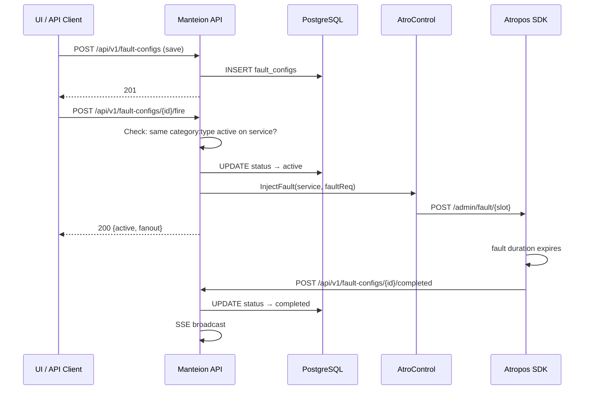

# Manually-Triggered Persistent Faults (v3)

Save fault configurations in Manteion, trigger on demand, support multiple concurrent faults of different types on the same service, and track lifecycle.

## Design Decisions (from review)

1. **Generalized table**: `fault_configs` instead of `trigger_configs` — reusable for future automation
2. **Editable when not running**: fault config can be updated when status ≠ `active`
3. **Same-type concurrency blocked**: Two `inline:latency` faults can't run on the same service simultaneously. But `inline:latency` + `resource:cpu` CAN coexist
4. **Cancel = "manually_cancelled"**: Distinct from duration-based auto-completion
5. **Re-triggerable** from `ready`, `completed`, `manually_cancelled`, `failed`
6. **Can't delete active**: Must cancel first

---

## Architecture



---

## Proposed Changes

### Component 1: Atropos SDK (`feat/multi-fault-admin`)

The current `DemoEvaluator` holds **one** fault. To support concurrent faults of different types, we extend it to hold **multiple faults keyed by `category:type`**.

#### [MODIFY] admin.go

**Extend `DemoEvaluator`** to support multiple concurrent faults:

```go
type DemoEvaluator struct {
    mu       sync.RWMutex
    slots    map[string]*faultSlot // key = "category:type", e.g. "inline:latency"
}

type faultSlot struct {
    decision    *Decision
    req         *FaultRequest
    callbackURL string
}
```

- `Set(decision, req)` → inserts/replaces the slot for `req.effectiveCategory() + ":" + req.Type`
- `Clear()` → clears ALL slots (backward compat)
- `ClearSlot(category, faultType)` → clears one slot
- `Evaluate()` → returns first matching decision (inline faults take priority, then iterate slots)
- `Active()` → returns slice of active `FaultRequest`s
- `ActiveSlot(category, faultType)` → returns single request or nil

The admin HTTP handler gets a new path for slot-based operations:

| Method | Path | Purpose |
|---|---|---|
| POST | `/admin/fault` | Set a fault (existing — now slot-aware) |
| GET | `/admin/fault` | Get all active faults |
| DELETE | `/admin/fault` | Clear all faults |
| DELETE | `/admin/fault/{category}/{type}` | Clear one fault slot |

`FaultRequest` gets one new optional field:
```go
CallbackURL string `json:"callback_url,omitempty"`
```

When `ClearSlot()` fires and `callbackURL` is set, it POSTs to the URL (best-effort, background goroutine).

#### [NEW] callback.go (~15 lines)

```go
func notifyCompletion(url string) {
    ctx, cancel := context.WithTimeout(context.Background(), 5*time.Second)
    defer cancel()
    req, _ := http.NewRequestWithContext(ctx, http.MethodPost, url, nil)
    http.DefaultClient.Do(req)
}
```

#### [MODIFY] admin_test.go

Add tests for multi-slot behavior:
- Set latency + CPU → both active
- Set two latency faults → second replaces first
- ClearSlot("inline", "latency") → only latency cleared, CPU still active
- Clear() → all cleared

---

### Component 2: Manteion Model

#### [NEW] internal/model/fault_config.go

```go
type FaultConfigStatus string
const (
    FaultConfigReady             FaultConfigStatus = "ready"
    FaultConfigActive            FaultConfigStatus = "active"
    FaultConfigCompleted         FaultConfigStatus = "completed"
    FaultConfigManuallyCancelled FaultConfigStatus = "manually_cancelled"
    FaultConfigFailed            FaultConfigStatus = "failed"
)

type FaultConfig struct {
    ID          string            `json:"id"`
    Name        string            `json:"name"`
    Description string            `json:"description,omitempty"`
    Service     string            `json:"service"`
    Category    string            `json:"category"`    // "inline","network","resource"
    FaultType   string            `json:"fault_type"`   // "latency","cpu", etc.
    FaultReq    json.RawMessage   `json:"fault_request"`
    Status      FaultConfigStatus `json:"status"`
    CreatedAt   time.Time         `json:"created_at"`
    UpdatedAt   time.Time         `json:"updated_at"`
    FiredAt     *time.Time        `json:"fired_at,omitempty"`
    CompletedAt *time.Time        `json:"completed_at,omitempty"`
}

func (f *FaultConfig) Validate() error { /* id, name, service, category, fault_type, fault_request required */ }
func (f *FaultConfig) CanFire() bool   { return f.Status != FaultConfigActive }
func (f *FaultConfig) CanEdit() bool   { return f.Status != FaultConfigActive }
func (f *FaultConfig) CanDelete() bool { return f.Status != FaultConfigActive }

// ConflictKey returns "category:type" for same-type concurrency checks.
func (f *FaultConfig) ConflictKey() string { return f.Category + ":" + f.FaultType }
```

---

### Component 3: Database Migration

#### [MODIFY] internal/db/migrations.go

Append migration 6:

```sql
CREATE TABLE IF NOT EXISTS fault_configs (
    id            TEXT PRIMARY KEY,
    name          TEXT NOT NULL,
    description   TEXT NOT NULL DEFAULT '',
    service       TEXT NOT NULL,
    category      TEXT NOT NULL CHECK (category IN ('inline','network','resource')),
    fault_type    TEXT NOT NULL,
    fault_request JSONB NOT NULL,
    status        TEXT NOT NULL DEFAULT 'ready'
                  CHECK (status IN ('ready','active','completed','manually_cancelled','failed')),
    created_at    TIMESTAMPTZ NOT NULL DEFAULT now(),
    updated_at    TIMESTAMPTZ NOT NULL DEFAULT now(),
    fired_at      TIMESTAMPTZ,
    completed_at  TIMESTAMPTZ
);
CREATE INDEX IF NOT EXISTS idx_fault_configs_service ON fault_configs(service);
CREATE INDEX IF NOT EXISTS idx_fault_configs_status ON fault_configs(status);
CREATE INDEX IF NOT EXISTS idx_fault_configs_conflict
    ON fault_configs(service, category, fault_type) WHERE status = 'active';
```

The `idx_fault_configs_conflict` partial index enables fast same-type concurrency checks.

---

### Component 4: Store

#### [NEW] internal/store/fault_config_repo.go

| Method | Purpose |
|---|---|
| `Create(ctx, *FaultConfig)` | INSERT |
| `Get(ctx, id)` | SELECT by PK |
| `List(ctx)` | All configs, ordered by created_at DESC |
| `ListByService(ctx, service)` | Filter by service |
| `Update(ctx, *FaultConfig)` | UPDATE (rejected if active) |
| `Delete(ctx, id)` | DELETE (rejected if active) |
| `MarkFired(ctx, id)` | status=active, fired_at=now() |
| `MarkCompleted(ctx, id)` | status=completed, completed_at=now() |
| `MarkManuallyCancelled(ctx, id)` | status=manually_cancelled, completed_at=now() |
| `MarkFailed(ctx, id)` | status=failed, completed_at=now() |
| `HasActiveConflict(ctx, service, category, faultType, excludeID)` | `SELECT EXISTS(... WHERE service=$1 AND category=$2 AND fault_type=$3 AND status='active' AND id!=$4)` |

---

### Component 5: API Handlers

#### [NEW] internal/api/fault_config_handler.go

| Method | Path | Purpose |
|---|---|---|
| POST | `/api/v1/fault-configs` | Create |
| GET | `/api/v1/fault-configs` | List (filters: `?service=`, `?status=`) |
| GET | `/api/v1/fault-configs/{id}` | Get one |
| PUT | `/api/v1/fault-configs/{id}` | Update (blocked when active) |
| DELETE | `/api/v1/fault-configs/{id}` | Delete (blocked when active) |
| POST | `/api/v1/fault-configs/{id}/fire` | Fire |
| POST | `/api/v1/fault-configs/{id}/cancel` | Cancel → `manually_cancelled` |
| POST | `/api/v1/fault-configs/{id}/completed` | SDK callback → `completed` |

**Fire handler** core logic:
```
1. Load config from DB
2. Check CanFire() → 409 if active
3. HasActiveConflict(service, category, fault_type) → 409 if same-type already active
4. Unmarshal FaultReq, inject callback_url
5. atrocontrol.InjectFault(service, faultReq)
6. MarkFired(id)
7. SSE broadcast "fault_config_state_changed"
```

**Cancel handler**: clears the specific slot via `DELETE /admin/fault/{category}/{type}` (not all faults), marks `manually_cancelled`, broadcasts SSE.

#### [MODIFY] internal/api/server.go

Add `faultConfigs *store.FaultConfigRepo`, `ctrl *atrocontrol.Controller`, `selfURL string` to Server. Register 8 routes.

---

## Files Changed Summary

| Repo | Action | File | Change |
|---|---|---|---|
| atropos-go | MODIFY | `admin.go` | Multi-slot DemoEvaluator + CallbackURL + slot-based DELETE |
| atropos-go | NEW | `callback.go` | `notifyCompletion()` helper |
| atropos-go | MODIFY | `admin_test.go` | Multi-slot tests |
| manteion-go | NEW | `internal/model/fault_config.go` | Domain types |
| manteion-go | MODIFY | `internal/db/migrations.go` | Migration 6 |
| manteion-go | NEW | `internal/store/fault_config_repo.go` | PostgreSQL repo |
| manteion-go | NEW | `internal/api/fault_config_handler.go` | 8 handlers |
| manteion-go | MODIFY | `internal/api/server.go` | Wiring + routes |
| manteion-go | MODIFY | `cmd/manteion/main.go` | Wire new deps |

## Implementation Order

| # | Repo | What |
|---|---|---|
| 1 | atropos-go | Multi-slot DemoEvaluator + callback |
| 2 | manteion-go | Model + migration |
| 3 | manteion-go | Store repo |
| 4 | manteion-go | CRUD handlers |
| 5 | manteion-go | Fire/cancel/completed handlers + wiring |
| 6 | both | Tests |

## Verification

```bash
# atropos-go
go test -v -run TestDemoEvaluator ./...
go build ./... && go vet ./...

# manteion-go
go test -v -run TestFaultConfig ./...
go build ./... && go vet ./...
```

Key test scenarios:
- Multi-slot: set latency + CPU → both active; set two latency → replaces
- Conflict check: fire CPU on svc-A, fire CPU on svc-A again → 409
- Fire CPU on svc-A, fire latency on svc-A → both succeed
- Cancel marks `manually_cancelled`; auto-complete marks `completed`
- Edit/delete blocked when active, allowed otherwise
- Re-fire from completed/cancelled/failed states
